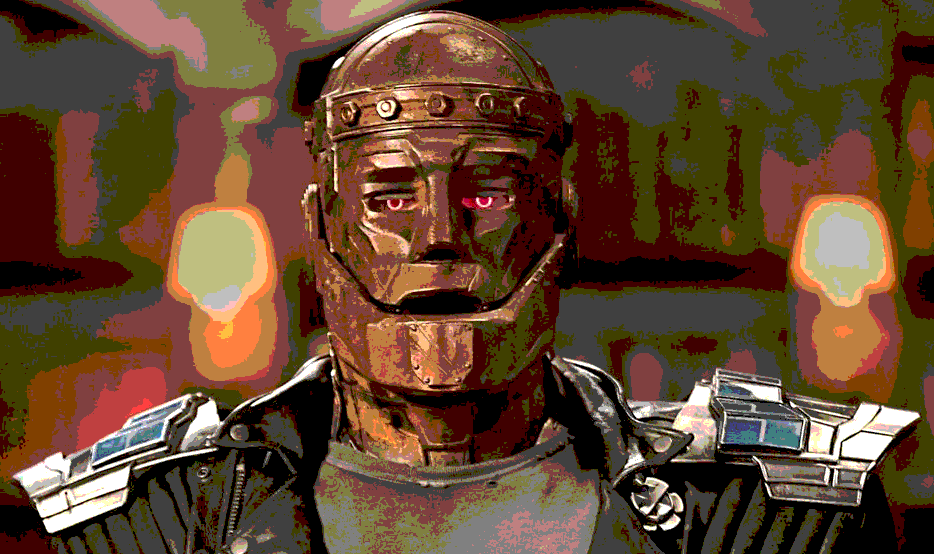
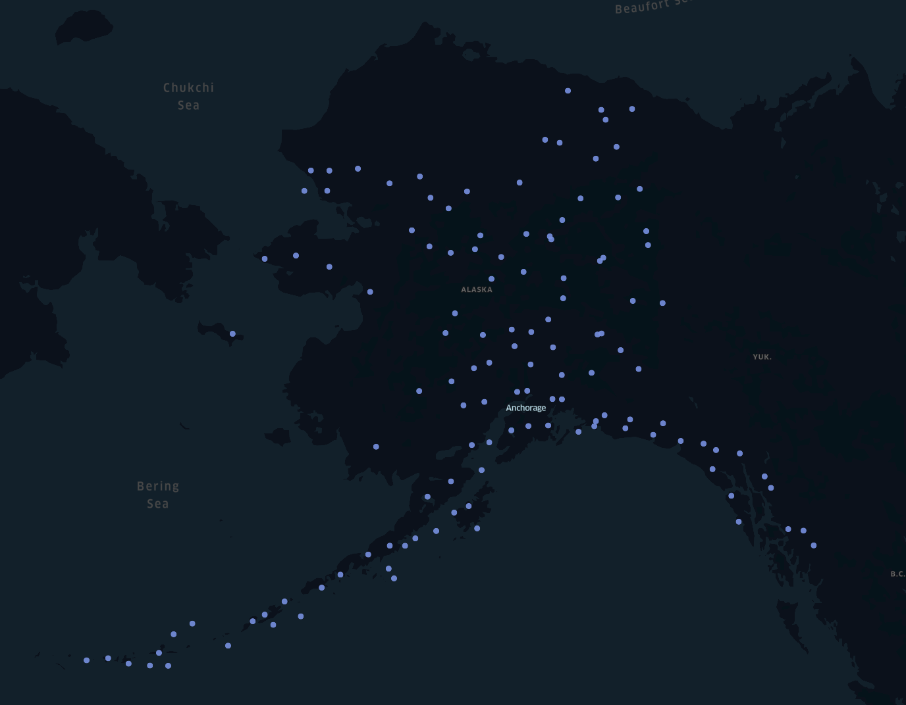

# Doom Patrol

Geospatial data store based on Astra and Stargate leveraging both the keyspace and document APIs.

## Components

### Astra & Stargate
Awesome C*aaS and API interfaces for powering the data layer behind our application.

#### Setup
1. Create an [Astra Database](https://astra.datastax.com)
1. Take note of the Database ID, Region, Username and Password
1. Export these values for the backend to use later
    
    ```console
    export ASTRA_DATABASE_ID=00000000-0000-0000-0000-000000000000
    export ASTRA_REGION=us-east1

    export ASTRA_DATABASE_USERNAME=MyAwesomeUsername
    export ASTRA_DATABASE_PASSWORD=MrNobody
    export ASTRA_KEYSPACE=dooooom
    ```
1. Create a new table in the CQLSH Console

    ```console
    CREATE TABLE dooooom.geohashes (
      geohash TEXT PRIMARY KEY,
      ids
    );
    ```

### Backend

Lightweight Flask application with helper libraries around GeoJSON, GeoHashing, and the Astra REST APIs.

#### Setup
```console
cd backend
virtualenv venv
source venv/bin/activate

pip3 install -r requirements.txt
```

#### Running
```console
cd backend
source venv/bin/activate

python3 main.py
```

#### Unit Tests

```console
cd backend
source venv/bin/activate
python -m unittest discover -s test -v -p '**test_*.py'
```



### Frontend

React Single Page Application (SPA) leveraging the [Kepler.gl](https://kepler.gl/) for visualizing GeoJSON data served by the backend.

#### Setup
1. Sign up for a MapBox API token

```console
cd frontend
npm install
```

#### Running
```console
cd frontend
npm run start
```
